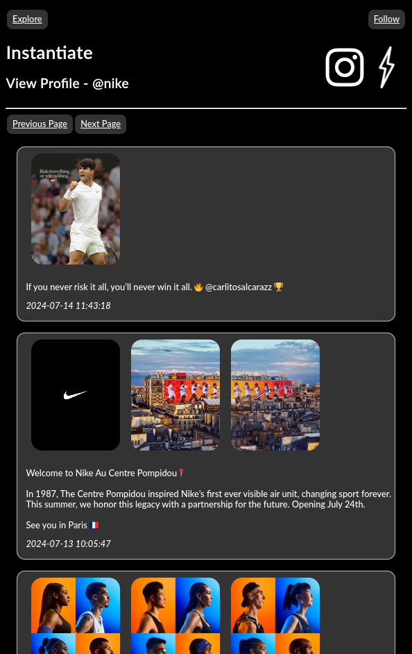

# Instantiate

An offline Instagram archive viewer.

## Description

Instantiate is a clean and modern web-interface to view an offline Instagram archive created by [Instaloader](https://instaloader.github.io/). Instantiate works entirely offline, and does not need an internet connection to function. It does not collect any telemetry, or communicate with Instagram in any way.

## Screenshots

## Features

### Private

Instantiate is the most private way to view your Instagram feed, since it uses an offline archive. No information is ever sent to Instagram.

### Archive

Instantiate allows you to view posts even after they have been deleted or banned from Instagram.

### Personalized

Instantiate isn't just another Instagram front-end. Instead, its a fully featured archive viewer, meaning you can view all the same accounts as you would normally have access to.

### Responsive

Instantiate uses responsive stylesheets that make it easy to use on a wide variety of screen sizes.

### Offline

Instantiate works entirely offline, and does not need an internet connection to function. As long as you have a stable connection to the server hosting it, everything will work consistently.

### Authenticated

Instantiate can serve as your private Instagram archive, or a way to share your archive with friends. It comes withs robust authentication controls to determine who can and can not access your archive.
